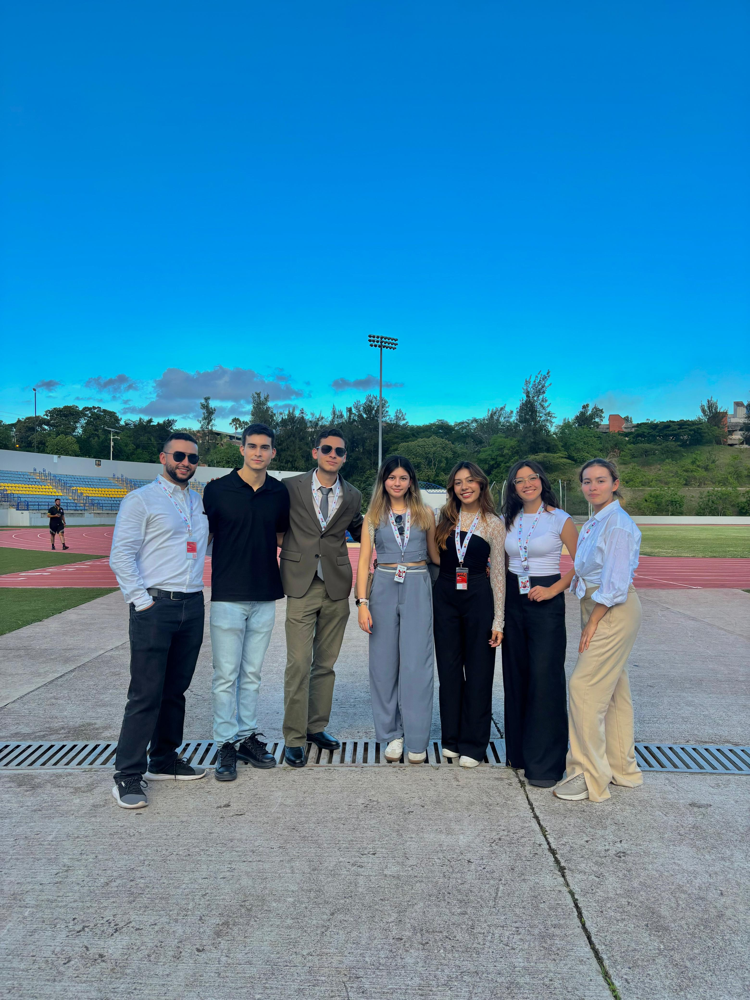

# 🇨🇴 **ALEIQ Colombia**
### *Asociación Latinoamericana de Estudiantes de Ingeniería Química – Delegación Colombia*
🧪 Ingeniería · Ciencia · Comunidad

---

### 🌍 ¿Quiénes somos?

Somos la delegación colombiana de la **ALEIQ**, una organización que conecta, impulsa y representa a los estudiantes de Ingeniería Química en toda Latinoamérica.  
Trabajamos para fortalecer la formación académica, técnica y humana de nuestros miembros, promoviendo la investigación, la innovación y el desarrollo sostenible.

---

### 🌐 Proyecto Digital

💻 Actualmente estamos desarrollando el **sitio web oficial de ALEIQ Colombia**, un espacio abierto y colaborativo que servirá para:

- 🧠 Difundir proyectos técnicos y académicos.  
- 📰 Publicar artículos, noticias y eventos.  
- 🔬 Compartir recursos educativos y herramientas digitales.  
- 🤝 Conectar a estudiantes y profesionales de Ingeniería Química.  

> 🚧 *Sitio web en construcción — próximamente disponible a través de GitHub Pages.*

---

### 🎯 Nuestra misión

> *“Conectar el conocimiento, la ciencia y las ideas para transformar el futuro de la Ingeniería Química en Colombia y Latinoamérica.”*

- Promover la colaboración entre delegaciones.  
- Fortalecer la investigación y la divulgación científica.  
- Fomentar el liderazgo estudiantil y la innovación técnica.  
- Representar a Colombia en el ámbito latinoamericano de la ALEIQ.

---

### 👥 Delegados Nacionales (2025 – 2026)

| Nombre | Cargo | Universidad |
|:----------------------|:------------------|:-----------------------------|
| **Juan David Parra Cantor** | Delegado Nacional 🇨🇴 | Est. Ingeniería Química – **UPB Medellín** |
| **Valeria Vegas Torres** | Delegada Nacional 🇨🇴 | Est. Biotecnología – **EIA** |

📸 **Delegados Nacionales – ALEIQ Colombia 2025–2026**

---

### 🧩 Qué encontrarás aquí

En este perfil de GitHub compartiremos:

- 📁 Repositorios de proyectos técnicos y académicos.  
- 🧮 Modelos, simulaciones y herramientas digitales.  
- 📚 Material de apoyo y documentación colaborativa.  
- 🧑‍🔬 Iniciativas de estudiantes de Ingeniería Química de todo el país.  

---

### 🤝 ¿Quieres colaborar?

Si eres estudiante o profesional del área y deseas contribuir con proyectos, artículos o recursos, ¡nos encantará contar contigo!  
Estaremos abriendo espacios de colaboración y contribución muy pronto.

---

### 📬 Contáctanos

📧 **aleiq.colombia@gmail.com**  
📸 [Instagram: @aleiq.colombia](https://instagram.com/aleiq.colombia)  
💼 [LinkedIn: ALEIQ Colombia](#) *(próximamente)*  

---

### 🧠 “La Ingeniería Química no solo transforma la materia, sino también las ideas.”  
**— Delegación ALEIQ Colombia**

---

⭐ *Hecho con orgullo por estudiantes colombianos de Ingeniería Química.*  
💻 *Sitio oficial en desarrollo — GitHub Pages 2025.*

